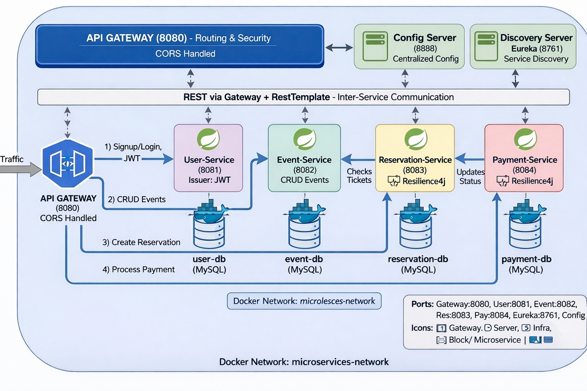

# Plateforme d'événements – Microservices Spring Boot

## Vue d'ensemble
Architecture microservices Dockerisée pour gérer des événements, réservations et paiements. L'infra Spring Cloud inclut Gateway, Config Server et Eureka. Communication REST via Gateway, Resilience4j sur réservation/paiement, JWT émis par le User-Service. Chaque MS a sa base MySQL dédiée.



## Services et ports
- API Gateway : 8080 (CORS, routage, sécurité de base)  
- Eureka Server : 8761 (découverte)  
- Config Server : 8888 (config centralisée)  
- User-Service : 8081 (auth/signup, JWT) – DB `user-db`  
- Event-Service : 8082 (CRUD événements) – DB `event-db`  
- Reservation-Service : 8083 (réservations, limite 4 tickets, check places) – DB `reservation-db`, Resilience4j  
- Payment-Service : 8084 (simulation paiement, MAJ statut) – DB `payment-db`, Resilience4j  
- Frontend (bonus) : 4200 (Angular, via nginx)

## Démarrage rapide
1. Prérequis : Docker / Docker Compose.  
2. À la racine :  
   ```bash
   docker compose up -d --build
   ```
3. Vérifier : `docker compose ps`, Eureka UI http://localhost:8761, Gateway http://localhost:8080.

## Tests et Swagger
- User-Service : http://localhost:8081/swagger-ui.html  
- Event-Service : http://localhost:8082/swagger-ui.html  
- Reservation-Service : http://localhost:8083/swagger-ui.html  
- Payment-Service : http://localhost:8084/swagger-ui.html  
- Exemples via Gateway :  
  - POST http://localhost:8080/auth/register  
  - POST http://localhost:8080/auth/login  
  - GET  http://localhost:8080/events  
  - POST http://localhost:8080/reservations  
  - POST http://localhost:8080/payments

## Communication et sécurité
- REST synchrones via API Gateway + RestTemplate (pas d’OpenFeign).  
- JWT émis par User-Service ; CORS géré au Gateway.  
- Resilience4j appliqué sur Reservation/Payment pour la tolérance aux pannes.  
- Config centralisée (Config Server) et découverte (Eureka) partagées par tous les MS.

## Bases de données
- 4 MySQL isolées (event/user/reservation/payment) sur le réseau Docker `microservices-network`.  
- Les conteneurs sont créés par `docker-compose.yml` avec leurs ports exposés (3307-3310).

## Frontend (bonus)
- Angular servi par nginx (4200) qui consomme l’API Gateway. Rafraîchir (Ctrl+F5) après rebuild.
